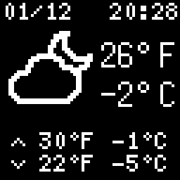
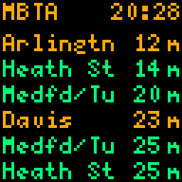
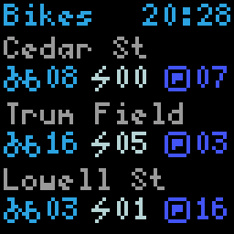

# LED Matrix Wall Sign

## Weather ([OpenWeatherMap](https://openweathermap.org/))



## MBTA ([General Transit Feed Specification](https://gtfs.org/documentation/overview/))



## BlueBikes ([General Bikeshare Feed Specification](https://gbfs.org/))



## Make a Fish ([makea.fish](http://makea.fish/))


# Development

Set up a virtual environment and install the requirements:

```bash
python3 -m venv .venv
source .venv/bin/activate
pip install -e .
```

Run with:

```bash
python3 main.py --simulate
```

# Matter pairing

Remove the existing cache with:

```
pi@matrix2:~/matrix2/matter $ sudo rm -rf .matter
```

Run it with something like:

```
pi@matrix2:~/matrix2/matter $ sudo /home/pi/.bun/bin/bun run start
```

It will print the QR code to the terminal that you can use for pairing!
